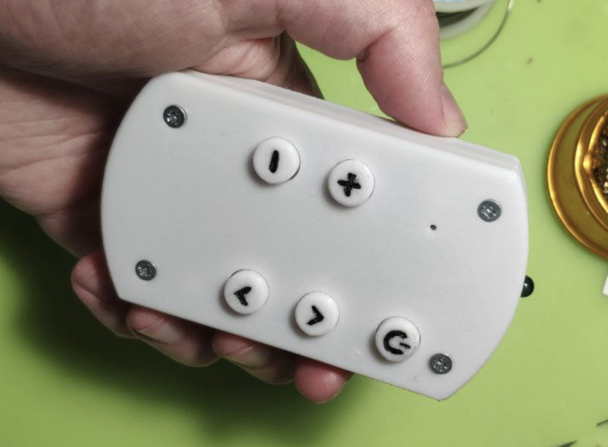
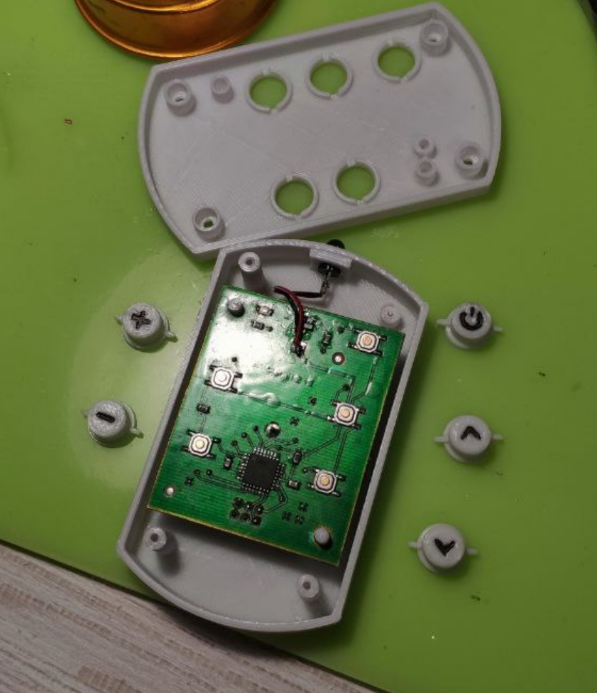

# SimplIR

The project of a joined IR Remote for controlling both Samsung LE26B450 TV and unknown TV Box that uses RC5 IR protocol.
SimplIR allows to switch TV On and Off, control volume and switch channels on TV Box.

## Hardware and Software

* ATmega48PA MCU with Arduino based firmware
* 5 tactile buttons
* 1 5mm IR LED
* CR-2030 battery
* Firmware uses [Arduino-IRremote](https://github.com/Arduino-IRremote/Arduino-IRremote) for sending codes to the TV Set and TV Box
* Low power consumption - 0.1 uA, when in sleep mode (most of the time)

## TODO

* increase IR LED power, probably, add more LEDs in parallel
* add external crystal to guarantee precise timings
* deal with low recognition rate of ON/OFF signal for Samsung TV

